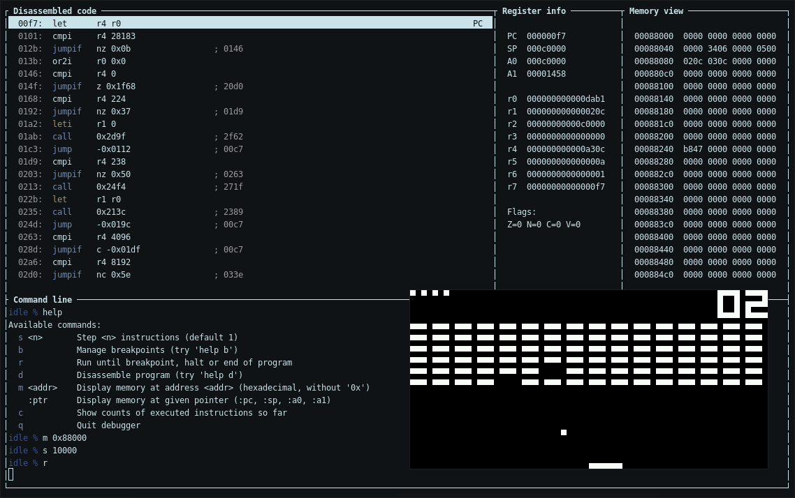

# Memory-light ISA

This repository hosts an assembler, an emulator and a couple of test programs
for a fictitious CPU architecture designed to minimize exchanges between CPU
and memory, presented at COMPAS 2018:

> Florent de Dinechin, Maxime Darrin, Antonin Dudermel, Sébastien Michelland, Alban Reynaud. Une architecture minimisant les échanges entre processeur et mémoire. ComPAS 2018 - Conférence d’informatique en Parallélisme, Architecture et Système, Jul 2018, Toulouse, France. pp.1-8. [⟨hal-01959855⟩](https://hal.inria.fr/hal-01959855)

The emulator has some debugger functions, and can be seen below running the
main example application, a nested CHIP-8 emulator:



This project was the result of an architecture class at [ENS de Lyon](http://www.ens-lyon.fr/),
and was inflicted upon the teachers of the compilers class the following year.

## The architecture

The architecture is mostly described in the conference paper and in
[`subject/isa2017v2.pdf`](subject/isa2017v2.pdf) (both in French). The main
idea is to have a fairly reduced instruction set, and to reduce the size of
instructions to a minimum in order to obtain the most compact encoding
possible.

Byte-level granularity is somewhat unsatisfying for the most common intructions
so everything is at the bit-level instead; even the memory is bit-addressable.

Most instructions use [Huffman coding](https://en.wikipedia.org/wiki/Huffman_coding)
to reduce the size of the instruction when the operands are small. The
instructions themselves are encoded using a Huffman scheme based on statistics
collected early on during the project.

There are 8 general-purpose registers and 2 pointer registers (called
"counters"). The default addressing mode is auto-increment; it's also the only
addressing mode, which is an obvious mistake IMHO.

The `doc` folder contains some informations on the calling conventions. In
particular, [`doc/remarks_fr.txt`](doc/remarks_fr.txt) contains some of the
finer analysis (in French).

## Building

Type `make` to assemble the example programs, build the emulator and assemble
the CHIP-8 emulator. The emulator requires ncurses. See
[`doc/emu_troubleshooting.md`](doc/emu_troubleshooting.md) for some common
problems.

## The "compiler" (assembler)

The assembler is in the `compiler` folder. It's a joint work with minimal
planning so the source is a little bit rough.

## The CHIP-8 emulator

This repository comes with possibly the least efficient CHIP-8 emulator out
there, running unoptimized assembler code through the emulator of a fictitious,
not particularly efficient architecture.

Use `./chip8_play.sh <GAME>` to play a CHIP-8 game. The list of cartridges is
in the `chip8/GAMES` folder. I might suggest:

```
% ./chip8_play.sh BRIX
```

To reproduce the screenshot above, change `-r` into `-d` in `chip8_play.sh`.
